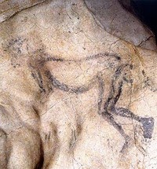
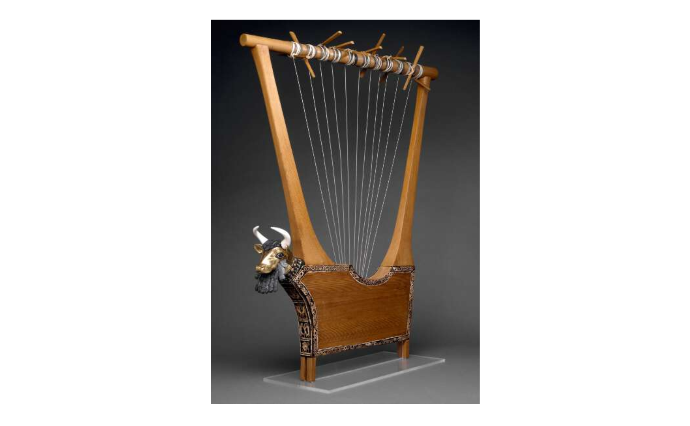
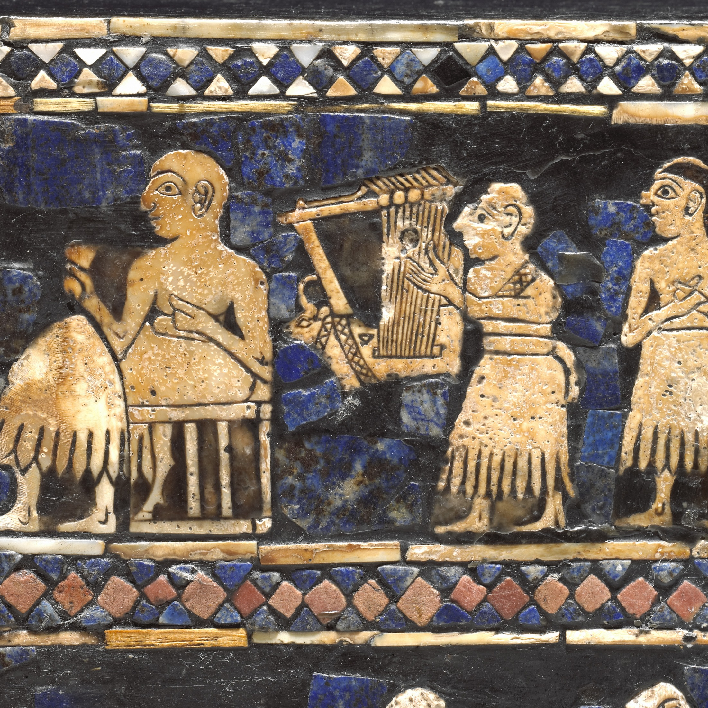
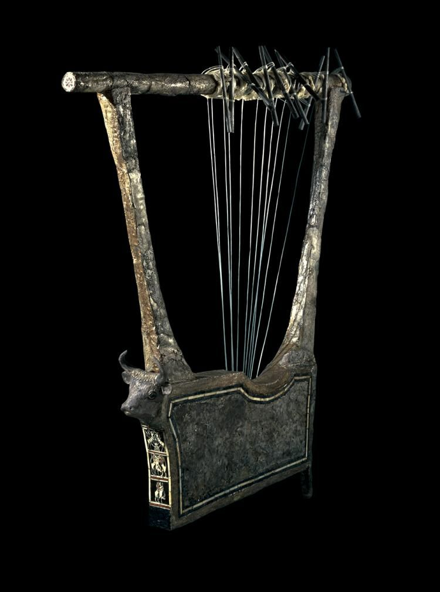
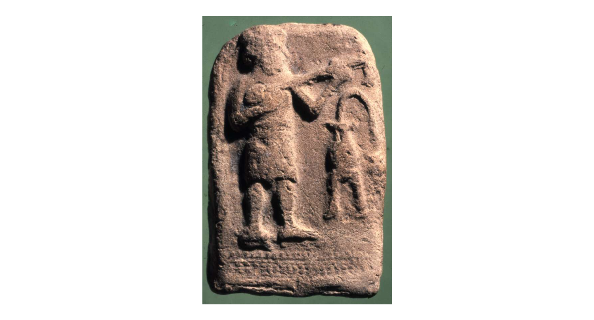
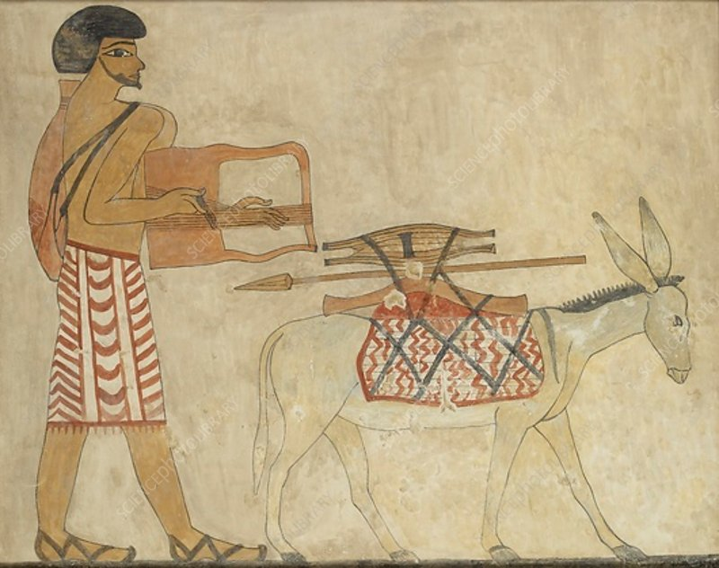

# 第一章 美索不达米亚和埃及

## 史前

也许，我们可以从非洲和马来西亚的现代俾格米人(Pygmies)、南非 布须曼人(Bushmen)、锡兰(Ceylon)（斯里兰卡）的 维达人(Vedda) 和火地岛(Tierra del Fugeo)的土著人的极为原始的音乐中，了解到一些最早的艺术。原始音乐本身是一个广阔而吸引人的领域，但是它属于民族音乐研究的范围，而不属于音乐史的领域。因为文化在进步的同时可能还会倒退，历史学家应当带着批判的眼光来接受其同行的观点。史前史学家对我们很有帮助，因为他们能提供诸如新石器时代带有指孔的骨笛，这样有明确年代或相近年代的证据，但是我们也不能对他们抱太大的希望。至少不能比他们本人所抱的希望更大。

 [^flute]

[^flute]: https://www.nytimes.com/2009/06/25/science/25flute.html

例如，在 莱特鲁瓦弗霄尔 的 马格达莱尼亚 山洞（在法国阿列日省）中 [Magdalenian cave of Les Trois Freres (Ariege)]，有一幅公元前约 13500 年的雕刻画，画中有个半人半兽像。

 [^trois-freres-sorcerer]

[^trois-freres-sorcerer]: http://www.visual-arts-cork.com/prehistoric/trois-freres-cave.htm

雅各塔·霍克斯(Jacquetta Hawkes) 认为可能是个经过伪装的猎人，尽管“总的看来，他似乎更像在参加一个仪式”。桑达斯(Sandars) 评论道：“半人半兽的鼻子上悬着的弓形物，事实上是附加在他鼻子和前臂上的，而不是他本身所具有的”。但是有一位著名音乐学家的想法更为大胆；他认为 “一位魔术师正在弹奏一种目前仍存在于南非 布须曼人 等非洲游牧部落中的乐弓”；这种弓“既可用以射箭，也可发出乐音，它被系在面具上，用右臂弹奏”。也有人认为，这一“弓形物”是支长笛。

音乐的真正历史既不从这种有争议的旧石器时代艺术的标本开始，也不从 20 世纪最原始民族的原始音乐开始，而是从我们所知道的，尽管我们知道得太少的最古老的音乐文化开始。

## 苏美尔 (Sumer)

人们普遍认为，文明的最早摇篮在公元前 4000 年前后的底格里斯河(Tigris)和幼发拉底河(Euphrates)之间，紧接着在尼罗河(Nile)流域、印度河(Indus)流域和黄河流域也先后发生了类似的人类文化的革命。

[^earliest_civilizations]

[^earliest_civilizations]: https://www.worldhistory.org/image/17844/first-wave--earliest-civilizations/

地理条件决定了，印度文明和中国文明同美索不达米亚文明和埃及文明相比，有更为独立地发展，后两者是近东文明和地中海东部地区文明的基础，它们最终发展成为希腊文明和犹太文明，因而它们也是早期基督教音乐和艺术的基础。所以为了方便起见，我们先考虑美索不达米亚文明和埃及文明，然后再讨论印度和中国的音乐。

确实，我们在美索不达米亚发现关于“高雅文化”的乐器和音乐演奏的最早描述，也发现了最早的乐器遗迹和最早关于音乐作用的描述。最早的描述以表音符号或表意符号的形式出现在苏美尔人的书写板上：半椭圆形的竖琴上带有三根弦，琴的下端比上端略厚，这可能是一块共鸣板。（各个时代用图形所作的描写都有这样一个缺陷：我们不知道艺术家的精确标准到底怎样。）

几乎同样的乐器出现在晚一些的早期王朝第一阶段；还有一些早期王朝第三阶段（约公元前 2600 年）的刻有人物浮雕的石灰石装饰板，其中有几件刻有弓形竖琴的演奏者，这种竖琴的弯曲程度比以前小，而且还带有六、七根弦；它们的尺寸不一，随演奏者身材大小而异，演奏者左手握住或抵住琴，用右手演奏。

公元前 2650 年前后产自 比斯玛雅(Bismaya) 的一个块滑石花瓶上画有两个人水平地持着竖琴；琴弦超出了琴颈，并像装饰一样悬垂着。

 [^arched_harp]

[^arched_harp]: https://en.wikipedia.org/wiki/Arched_Harp

不列颠博物馆所藏的从乌尔王室墓地发掘的著名的“普阿比皇后之琴(Harp of Queen Pu-abi)”则比它们复杂得多；琴颈变直了，共鸣箱也扩大了，过去的弓形因而成了三角形，琴弦也增加到十一根。（这种乐器曾两次被错误地用另一种乐器 里尔琴 的共鸣箱予以复原。）

 [^queen_lyre]

[^queen_lyre]: https://www.britishmuseum.org/collection/object/W_1928-1010-1-a

里尔琴与竖琴之间的差别在于，它的弦装在共鸣箱和用胳膊支撑的横杆之间。早在早期王朝第二阶段，苏美尔人就已经知道这种乐器。根据印章和其他浮雕来看，最早的里尔琴的共鸣箱形状像一头公牛；无疑，这一形象是具有宗教意义的（据说它的声音也很像公牛的吼叫声）。公牛的两腿用作 大而沉重的琴身立于地面上的支脚，但是图上所示的琴还是由演奏者用手持着的。

后来，琴身的式样又经历了不少改变，但是牛头仍然装饰在共鸣箱上；它还被认为是 乌尔人 的 “旗标”。我们可以从一块描述祝捷宴会场面的镶嵌板上看到这样一种琴。

 [^lyres_of_ur]

[^lyres_of_ur]: https://en.wikipedia.org/wiki/Lyres_of_Ur

也可以在不列颠博物馆和费城的大学博物馆中看到，从乌尔王室墓地发掘出来的乐器的真品。

费城所藏乐器的共鸣箱上用镶嵌物描绘了一头蹲着的驴正在弹奏另一种这样的里尔琴，这把里尔琴由一只在其他苏美尔艺术中作为动物音乐家的熊持着，而另一只小动物则坐在熊的脚上敲打手鼓并摇着铃鼓。

[^philadelphia_lyre]

[^philadelphia_lyre]: https://www.penn.museum/collections/object/42298

在 基什(Kish)和乌尔(Ur) 发现了铜制的拍板，它们还被描绘于印章上。竖琴、里尔琴以及两三种简单的打击乐器，这就是最早的“高雅文化”中仅有的乐器。当时管乐器之稀少是十分令人吃惊的。或许原本就十分少见的图像资料中所呈现的根本就不是乐器。

不过从 哈法耶(Khafaje) 发掘出来的碎片中和 比斯玛雅(Bismaya) 花瓶上可以看到，人们正在吹着一些长长的锥形管子，这大概是小号。我们目前所知的事实上就是一支大约九英寸长的银制双管，其中一管有四个指孔，另一管有一个指孔；还有一支现在藏于费城的从乌尔人墓地中发掘出来的簧片乐器。我们不可能用文学作品中的名称来确定这些乐器，而且也不能够随随便便地推测这些乐器所奏出的音乐以及有时在演奏者身边的人所唱的歌。另一方面，我们也确实知道许多有关职业音乐家的训练和职责的情况。我们甚至还知道早期王朝第三阶段前期的一位音乐家的名字：巴-巴布-比-加吉尔-加尔(Pa-Pab-Bi-gagir-gal)，其中“加尔”是“大”的意思。

公元前 2000 年以后，有些音乐家被命名为“王室仆从”、“神殿侍者”等，使音乐从最早的时候就开始同魔法和宗教紧密地联系起来。这些音乐家被分成两种类型：加拉(gala) 和那尔(nar)，他们的职责差别很大，有些现代权威甚至认为他们的职责截然相反，而每一种类型又被分成三个等级。据我们所知，有大量文学作品描写了他们所唱或所吟的歌：最古的时候只不过是简单的诗篇或赞美诗，后来出于礼拜仪式的需要变得越来越复杂。文献记载表明，当时人们已使用乐器，希伯来人在诗篇中还采用了交替歌唱和应答歌唱的形式。但是在苏美尔，文明的中心在于宗教，音乐主要用于宗教仪式，同时也是筵席、凯旋、葬礼等仪式的一个特色。

## 苏美尔以后的音乐

公元前 2370 年左右以后，闪米特阿卡德人(Semitic Akkadians) 征服了 苏美尔人，把平原上的城邦统一在一个君主之下。此后，这个地方又遭到来自山上的野蛮人 古地人 的蹂躏。但是，阿卡德人吸收了苏美尔的文化。甚至在古地人统治时期，拉加什(Lagash)（泰洛(Telloh)）这个城市在 古得阿(Gudea) 的统治下依然是一个艺术上有非凡成就的孤岛。当时的一些著作描述了与 古得阿 的最大成就，重建城市守护神 宁吉尔苏(Ningirsu) 的神殿 埃尼努(Eninnu) 相关的音乐：例如，国王教导神殿乐师长“要努力研习吹
管的技术，使埃尼努的前院充满欢乐”。他们还讲到了牛角号。一块现存于罗浮宫(Louvre)的发现于 拉加什(Lagash) 的石碑上刻有一个坐着的人正在弹奏一架很大的里尔琴它的横杆上耸到他的头顶。这架琴很像从乌尔墓发掘出来的里尔琴，唯一的差别在于，共鸣箱上不是一只牛头，而是一头站着的牛，它的一条前肢向上伸起。另一块 拉加什石碑和乌尔石碑上刻若一些巨大的手鼓，它们放在地上时和人的肩膀一样高。

复辟后在乌尔第三王朝统治下的苏美尔王国又被 埃拉米特人(Elamites) 和 阿莫里特人(Amorites) 推翻，另一个城邦时期结束于公元前 2000 年左右，随后的朝代都相继建立于 伊辛(Isin)，拉尔萨(Larsa) 和 巴比伦(Babylon) 的基础之上。巴比伦王朝的国王，其中最著名的要数 汉谟拉比(Hammurabi)，他是 阿莫里特人，他们是一些在美索不达米亚定居了很长时间的西部闪米特人(Amorites)。人们认为他们就是目前发现的新式乐器的主人，可是这样的看法并不完全正确。这些乐器中有一种新式里尔琴，比其他里尔琴小得多也轻得多，由演奏者倾斜地或水平地持在手上，共鸣箱抵在演奏者的身上，用拨子弹奏，左手似乎也接触琴弦。竖琴不再是弓形的了，琴颈几乎与共鸣箱成直角，演奏者把琴垂直地抵在身上用手弹拨，或者水平地持着用拨子弹奏。

 [^relief_harpist]
[^relief_harpist]: https://en.m.wikipedia.org/wiki/File:Relief_harpist_Louvre_AO12453.jpg

我们可以在一幅发现于 拉加什(Lagash) 的 拉尔萨(Larsa)时期浮雕上看到一种琴颈很长的琉特琴类乐器；

 [^lute]

[^lute]: https://www.britishmuseum.org/collection/object/W_1914-0407-9

而另一幅现藏于不列颠博物馆的拉尔萨浮雕，则描绘了一只很大的、带有支脚的鼓，很像现代的定音鼓，演奏者用双拳敲打鼓面，另一个坐着的人正敲打着小钹。

巴比伦第一王朝以后，我们关于美索不达米亚音乐的知识出现了几个世纪的空白，这是由于赫梯(Hittites)、卡西(Kassites)和胡尔(Hurrians)等新兴民族的入侵造成的。赫梯人于公元前 1585 年前后占领了巴比伦，建立了一个强大而地域广阔的国家。但文献记载表明，他们只有一种与 伊什塔(Ishtar) 女神有关的琉特琴类木制乐器；他们的绘画艺术中所表现的只不过是双管、小里尔琴、琉特琴和鼓之类他们与之交往的美索不达米
亚人和埃及人早已知道了的乐器。

同样，我们还必须考察产下这个时期的另一种文化，爱琴海(Aegean)文化。基克拉迪岛(Cycladic) 仅有的遗迹是在 阿莫戈斯岛(Amorgos) 上发现的大理石小雕像，这些小雕像上描绘有三角形的竖琴和用双手呈 V 形持握的一种双管。在克里特岛(Crete)上人们发现了一枚 中米诺斯(Middle Minoan) 时代的印章，上面刻着一把里尔琴和一把双竖琴；但这些乐器的形状十分古怪，看上去显然是为适合圆形印章特意设计的。在 哈吉亚特利亚达(Hagia Triada) 发现的一只花瓶上画着个男人，他领着一队唱歌的收获者，并在高处摇着一只和埃及式样十分相似的马蹄形叉铃。还有一幅绘有双管的画，刻有大里尔琴的石棺，以及“别墅”中一幅画的碎片，画中一个妇女和一个祭司正在演奏里尔琴，这些也都发现于 哈吉亚特利亚达，其年代是公元前 1400 年前后那场灾难的前夕。这些画上同时描述了手指和拨子的技术；琴上有七根弦，共鸣箱延伸到弯曲程度很大的琴臂，与更早的埃及里尔琴并没有明显的差别。

## 埃及：古王国

的确，我们必须转向公元前 2000 年至前 1000 年间的埃及，才能对乐器的发展和音乐的作用有一个清楚的了解。当然，埃及音乐的起源要比这个时候更早，但是不会和美索不达米亚音乐一样早。

大致上和乌尔王室墓地同时代的大量第五王朝时代的浮雕上描绘了与美索不达米亚有关的乐器。（关于拍板和摇响器等更多的原始乐器的描述出现得还要早些，但古代丧葬船上所画的“号角”却似乎是用来伪装人声，而不是演奏音乐的。）尽管古王国时期的乐器几乎没有保存下来，但是当时的浮雕和绘画一般来说比美索不达米亚的精确，而且也可能比较确切地知道它们的名称。

在 萨卡拉(Sakkara) 的 蒂(Ti) 和 梅雷卢卡(Mereruka) 墓的浮雕中，在 吉萨(Giza) 的 卡耶曼赫(Kaiemankh) 墓的上层建筑里的绘画中，都描绘了一种称为宾特(bint)的弓形竖琴，这种琴的式样和早期美索不达米亚的乐器差不多，通常有五至七根弦，但有比较先进的共鸣腔，有时还装饰以 荷鲁斯(Horus) 的眼睛；很长的笛子通常没有指孔，吹奏者手持它时要使笛身保持倾斜；比较短的双管根据后来的标本只有一块簧片，人们曾称它为“双单簧管”；还有叉形的拍板和手鼓。乐师们通常坐着，他们中至少有一架竖琴有时候是两架，还有一支长的笛子一一也许是一根伴音管：每一个演奏者都面对一个歌唱者，这些歌唱者都把左手放在左耳上，相互之间作一些常规的手势，这些手势也许是用来帮助记忆的，它们与今天 科普特人(Coptic) 在圣事吟唱中所用的手势十分相像。正如有些美索不达米亚图画所示的那样，歌唱者有时会卡住自己的喉咙。

如果有人跳舞的话，他们就会拍手使用木制或象牙制的拍板；但这舞蹈（有时是无声的）看来是很有节制的。

## 埃及：中王国

在中王国时期，人们仍然演奏同样的乐器，也有一些新乐器出现，主要是一种较小的、轻便的肩式竖琴；某些比较大的肩式竖琴的共鸣箱扩大了很多，琴颈相应地缩短了。当时已经有一种圆桶形的称为泰本(teben)的鼓，还有一些新式的叉铃，有的用陶、木或金属制成马镫形的框架，称为塞亨(sekhem)，有的制成房屋或神殿的形状（有时被称为 塞谢谢特(Sesheshet) 或 闹斯叉铃(Naos-Sistrum)）；这两种叉铃的手柄都雕成爱情与欢乐女神 哈托(Hathor) 的头，人们对她顶礼膜拜的一个重要部分就是和叉铃跳舞。叉铃通常是一种神殿用具，它既是宗教的象征，也是一种乐器。闪米特的 希克索斯王(Hyksos) 们在公元前约 1650 年至前 1550 年间统治了埃及的大部分土地；在他们的统治下，埃及引进了不少外来的东西，尽管希克索斯王自己并没有留下什么文学或绘画艺术。甚至在这之前，一幅公元前 1890 年前后贝尼哈桑(Beni Hasan)墓中的画，描绘的是 贝督因人(Bedouin) 正要去拜见 奥里克斯省(Oryx) 的总督，其中一人在演奏里尔琴，这种“新式”里尔琴几乎与闪米特人在同一年代传到美索不达米亚的完全相同。

 [^beni_hasan]

[^beni_hasan]: https://www.sciencephoto.com/media/980616/view/private-tomb-3-of-khnumhotpe-iii-beni-hasan

## 埃及：新王国

自希克索斯王被废黜以后，在第十八王朝，即新王国（公元前 1550 年至前 1080 年前后）第一个王朝的统治下，开始了艺术发展的辉煌时期，这个时期可以同意大利文艺复兴相媲美。这个时期出现了 卡纳克(Karnak) 和 卢克索(Luxor) 的神殿、在 阿玛那(Amarna) 信奉异端和一神教的 阿亨那腾(Akhenaten) 及其王后 尼费尔蒂蒂(Nefertiti)、在 底比斯(Thebes) 恢复旧宗教的 图坦哈蒙(Tutankhamun)，甚至还出现了若干激发艺术创作的宗教变革，它们促进新信仰的产生，并在更广阔的基础上重新建立旧的信仰。

当时的国际交往十分活跃。在 阿玛那，迈锡尼(Mycenaean)工匠为新的首都进行装饰，他们在战争与和平的环境中同 米坦尼人(Mitannians)、卡锡人(Kassites)和赫梯人(Hittites)进行频繁的接触。音乐也加入了这次文化大扩张；演奏新式乐器或精心制作的老式乐器的音乐家们大量出现在壁画和浮雕上；其中有些乐器一直保存到了今天。

大的弓形竖琴仍然十分流行；还引进了弯曲更加明显的弓形竖琴，它的底部加上了支撑物，以免共鸣箱接触地面。另一种新式弓形竖琴比较小，有三至四根弦，由演奏者背在肩上。在 阿美诺菲斯二世(Amenophis II) 统治时期，又出现了另一种十分轻便的竖琴：竖式共鸣箱和琴颈与其下端成直角。三角竖琴不像弓形竖琴那样流行，但它影响了弓形竖琴的形状，导致一种略呈弓形的竖琴产生，其共鸣箱上端的琴颈突然折成水平的直颈。关于这种琴，可参见 底比斯 的 拉美西斯三世(Ramesses III) 墓（公元前约 1166 年：第二十王朝）中所画高达六英尺的两件大乐器。它们分别有十一和十三根弦。通常是七根弦的里尔琴采用了一种崭新的形状，它的两臂按不等的长度精心地弯曲着，从而使横杆不再与共鸣箱平行：

.jpg) [^egypt2]

[^egypt2]: https://www.meisterdrucke.ie/fine-art-prints/Unbekannt/724139/Egyptian-arched-harp%2C-lute%2C-double-oboe-and-lyre%2C-tomb-painting-in-Veset-Thebes-c.1420-1411-B.C.html

我们不完全知道这是哪国乐器，因为在 奥克亨那坦(Akhenaten) 时代用拨子或手指演奏的少女似乎是叙利亚人，而它最早的名称（公元前约 1200 年）克那那乌尔(kenanawr) 却像是闪米特语（参见希伯来语(Hebrew) kinnôr）。到这一时期的后叶，琴臂成了等长的，并冠以雅致的兽头。公元前 1500 年前后，美索不达米亚的琉特琴也正式被接受了。这一时期的乐器实物，一件藏于纽约大都会博物馆；还有一件藏于开罗博物馆，它发现于一个名叫 哈莫西斯(Harmosis) 的乐师墓地。此后，人们在绘画中表现了大量乐器。共鸣箱一般较小，有各种各样的形状、表面常包有兽皮或羊皮纸；琴颈很长，通常有两根弦（哈莫西斯的乐器为三根弦），用拨子弹奏。

男性职业乐师喜欢用很大的琉特琴，而女奴（通常赤裸着身子）则使用比较小的琴。（在底比斯的 纳赫特(Nakht) 墓中，有一幅 图特摩斯四世(Thutmosis IV) 时期的壁画，画中的琉特琴弹奏者赤裸着身子，而那些演奏双管和竖琴的同伴却都穿着衣服；这幅画也许是有意义的）

纳赫特 墓中的少女吹奏手持两根叉开的管，那是这个时期所特有的。第十八王朝开创以后，那种平行系在一起的双管很快消失了，长长的、单根的管就更少了。管总是由女人吹奏的，而小号则自然是男人所用的乐器。在新王国时期，小号在军队和其他队列中的作用已十分明确；它不再像过去是一种有疑问的乐器。目前开罗博物馆藏有从图坦哈蒙(Tutankhamun)墓中发现的两件非凡的乐器，其中一件用铜和金制成，另一件则是银制的；它们都有漏斗形的喇叭口，但却没有真正的吹口；管子的顶端有个金属环，这也许就是吹口。

1933 年，珀西瓦尔·柯尔比(Percival Kirby) 用这两件乐器各吹出两个音；用银质乐器吹出第四泛音（音色比较沉闷）和第十泛音（音质比较明亮）a♭(A♭3) - c''(C5)，用另一件乐器吹出了较高的音。但是，小号仍然主要用以发送信号，以后的三千年内还是这样。在新王国时代，打击乐器经常作为工艺品出现；例如，拍板有时用象牙制成，并被刻成小手的形状。图坦哈蒙墓中有五件这样的乐器：用锁金木块制成的叉铃、铜制叉铃、象牙制的响板等等。在图特摩斯三世(Tuthmosis III)时代，又出现一种奇怪的长方形的鼓或铃鼓，通常由妇女配合着其他乐器演奏。同一个时期，人们在每年洪水涨到最高点的时候庆祝阿蒙节(Amun)，神与配偶带着他们的儿子由水载着从 卡纳克(Karnak) 送到 奥佩特(Opet)[卢克索(Luxor)]；有关这个节日的艺术作品中还描述了一种桶形的鼓。

绘画艺术使我们了解到许多关于乐器及其演奏的知识：大量的女乐师（不仅是大户人家的女奴，还有神殿乐师）、男性盲人歌唱者和竖琴弹奏者等等，这确实表明了演奏者不再面对着做手势的歌唱者了。然而，这些艺术作品在提供事实根据的同时，也提出不少问题。大量带着琉特琴和叉开的双管女奴的流入，无疑是军事上胜利的结果。但是为什么乐师都是盲人呢？手势的消失意味着什么呢？也许人们已经发明了一种书面记谱法，但是至今为止，除了一些零散的记忆符号外，还没有发现任何可信的证据。尽管人们提出许多理论，仔细测量许多保存下来的笛管及其指孔，计算琴弦并考察图中手的位置，仍然不知道当时是如何调音的。可以肯定，埃及人和苏美尔人一样，也用过一种低音管。如果在双管的第二根管上开一个或几个孔，只要用手指或蜡就可以改变低音管的音高。但是旋律管、竖琴或里尔琴到底能奏出哪些音程则无法知道；我们只知道，这些音程不会是半音。当然，亚洲琉特琴可以奏出小而多变的音程。关于音程排列的样式，我们知道的就更少了。当里尔琴和笛管一起演奏或者琉特琴也加入其中
时，我们不知道它们怎么能奏出同一个旋律。

众多的文学作品证实了从图画和浮雕中了解的音乐的一般作用：在家中和在宴会上，在行进的队伍和葬礼中以及在神殿里。但是音乐对于我们的最大价值，却在于和苏美尔人一样的叠歌、礼拜仪式经文的应答结构、赞美诗和哀歌中，这些都会反映在他们用以吟唱的音乐中、并决定音乐的形式。而圣歌和圣咏通常是用乐器伴奏的。

## 衰落中的埃及

第十八王朝以后，艺术进入了大萧条时期，但是很难说这到底是因为当时的音乐活动减少了，还是关于音乐的描写减少了。开始可能是政治上的原因。艺术得以繁荣的相对和平与兴旺消失了，取而代之的是王权的削弱以及来自海上和陆地的外部压力。其中有被 拉美塞斯三世(Ramesses III) 击败的“海盗”，他们包括 达努人(Danu)，这可能就是达瑙人(Danaoi)[希腊人(Greeks)] 和佩勒塞特人(Peleset)，他们肯定就是 腓力斯丁(Philistines) 人，或许还有 希罗多德(Herodotus) 所说的 佩拉斯吉人(Pelasgians)（可能是逃亡的迈锡尼人？）。

最后，埃及于公元前 7 世纪被亚述人(Assyrians)征服，公元前 6 世纪和前 4 世纪被波斯人(Persians)征服，随后又于公元前 332 年被亚历山大大帝(Alexander)征服。尽管在这段漫长的时期内，埃及文化有过几次复兴（如公元前 8 世纪至前 6 世纪之间的笫二十五王朝和第二十六王朝时期），但是受到越来越多的外来影响，并逐渐融入了一般的地中海东部文化。我们可以认为，埃及音乐是地中海东部音乐的主要部分，而且乐器样式的改变不像音乐风格和习俗的改变那样大。确实，古代乐器的形状仍然通过民间流传一直保持到今天，例如被称为 纳依(Nay) 的笛子和被称为 祖馬拿管(羌笛)(zummarah) 的“双重单簧管”，以及埃塞俄比亚和苏丹的古埃及式里尔琴。但是为了更清楚地了解公元前 9 世纪的乐器和音乐演奏的情况，必须首先考察美索不达米亚。

## 亚述帝国 (THE ASSYRIAN EMPIRE)

公元前 1000 年后不久，好战的亚述侵略者成了美索不达米亚的统治者。在宗教和文化方面，他们是巴比伦的继承人；他们的艺术用来歌颂自己的国王，歌颂他们的狩猎技能和残忍的军事上的胜利，不是用来膜拜上帝的；由于有关他们音乐的学识主要来自石和铜的浮雕，因而我们的看法可能略有偏差。亚述人肯定在很多场合都演奏音乐，但是就我们所知，他们的音乐都和国王的战俘、国王在他杀死的牲畜上洒奠酒、国王和王后在花园散步（不幸的苏萨(Susa)国王的头颅挂在树上）、乐师去迎接双手提着血淋淋头颅的人有关。我们有许多自 亚述纳西拔二世(Ashurnasirpal II)（公元前 883 年至前 859 年）至 亚述巴尼拔(Ashurbanipal) 统治时期(公元前 668 年至前 626 年) 的，特别是从公元前 9 世纪至前 7 世纪的艺术作品。亚述纳西拔二世是第一个到达地中海的亚述国王，他在新首都 尼姆鲁德(Nimrud) 的东南宫殿中所藏的从西方掠夺来的战利品中有一只象牙盒子，上面刻着一些女乐师的图像。根据 R.D.巴尼特(Richard David Barnett) 的解释，它的边缘刻有“腓尼基字母(Phoenician) 或阿拉米字母(Aramaean)”，两个乐师正在演奏手鼓和双管，在她们身后，还有两个乐师在演奏轮廓分明的长方形乐器，可能是一种齐特琴(zither)，也可能是一种木琴(xylophone)。（韦格纳(Vegner)认为是木琴。他还认为，辛那赫里布(Sennacherib) 时代的 尼尼韦(Nineveh) 浮雕上依稀可见的并非完全不同的乐器是一种里尔琴）从尼姆鲁德的一座浮雕（现藏于不列颠博物馆）上，可以看到更典型的亚述乐器。浮雕上描绘了两个男子正在用拨子弹奏竖琴，另一个人在敲打小鼓；有九根弦的竖琴共鸣箱很长，它被演奏者平持着；每一端都刻有小手的短短的琴颈从离演奏者最远的一端垂直直立起来。这些琴都呈三角形而非弓形。此外，它们还可能就是十八个世纪以前比斯玛雅花瓶上所画的乐器；在以后有关水平竖琴的艺术作品上，这一相似性表现得更为明显：琴弦悬挂在琴颈下，琴颈的顶端装饰着雕刻的小手。不管在哪个时期，琉特琴类乐器在亚述艺术中都很少出现。关于亚述的打击乐，不列颠博物馆中藏有大量的铜制小钹和钟。铜钟可能是系在马具或祭司服上的，因此并不是严格意义上的乐器。除此之外，博物馆中还藏有一些甲壳响板。

撒缦以色(Shalmaneser)三世和以后不久的一些统治者在位时的浮雕，并没有提供什么新的东西，可是一座小雕像中看上去有支弯曲的双管，它发现于埃兰的苏萨(Elamite Susa)，属于 提革拉帕拉萨(Tiglathpileser)三世时期。从 辛那赫里布(Sennacherib) 时期的画上也可以看到一些里尔琴；其中有琴臂直而不等长的里尔琴。

 [^gypsum]

[^gypsum]: https://www.britishmuseum.org/collection/object/W_1856-0909-8

也有上面讲到神奇的“齐特琴或木琴”时提到的那座浮雕上的曲臂里尔琴（还有手鼓和小钹）。不列颠博物馆有一座特别有趣的浮雕，上面刻着两个号手，一个发出信号，让大家来搬一座巨大的雕像，另一个手持长长的锥形管乐器，很像前面讲到的 哈法耶 碎片和 比斯玛雅 花瓶上描绘的那种乐器，但和埃及的小号有很大差别。有许多 亚述巴尼拔(Ashurbanipal) 时期的图片，其中最著名的图片描写的并不是亚述乐师，而是埃兰人乐师：战败的 苏萨国王特乌曼(Teumman) 宫殿乐师出城迎接战胜者强加于他们的新国王。这幅画经常被整体或局部地复制。男男女女用手指弹奏着大约有二十根弦的直立的竖琴；“延伸了的弦”悬挂在水平的琴颈下，看上去比较粗，好像是长长的装饰带而不是琴弦。而一架水平的竖琴在琴弦延伸部分的末端确实有一些装饰带。一个男子和一个女子在演奏双管，另一个女子在敲鼓。这是美索不达米亚艺术中所表现的最大的乐队，他们身后有一个合唱队，由六名妇女和九名儿童组成，一名妇女用手卡着自己的喉咙。

 [^panel_relief]

[^panel_relief]: https://www.britishmuseum.org/collection/object/W_1851-0902-7-c

这个时期的另一些浮雕上，描绘了一些直立的竖琴和水平的竖琴，琴弦通常是延长的，但只有两件作品描绘了里尔琴，这些里尔琴具有弯曲度很大的琴轭(è)和弯曲的琴臂，使人想起 塞浦路斯 的 伊达里昂(Idalion)和库里昂(Kurion) 发现的更早的铜碗和银碗上描绘的图案。长颈琉特琴是一种很古老的美索不达米亚乐器，但它仍然十分少见；很可能在它所流行的人群中没有留下绘画记载。

## 尼布甲尼撒的“管弦乐队” (NEBUCHADNEZZAR’S ALLEGED ORCHESTRA)

公元前 612 年，尼尼韦(Nineveh) 的亚述王朝被推翻，加勒底(Chaldaean)国王们在巴比伦统治了七十年左右，直到公元前 539 年 居鲁士大帝(Cyrus the Great) 征服新巴比伦王国，美索不达米亚就成了波斯帝国的一个部分。

这个“新巴比伦”时期并没有为我们留下什么描绘音乐家的艺术作品。关于这一时期的音乐，一些稍晚发现于巴比伦的希腊化时期的赤陶小塑像，描绘了双管、鼓、直立竖琴和小钹的演奏者，但它们并没有显示任何创新。

关于为 尼布甲尼撒 所立之金像，行开光之礼的著名乐队，我们对《但以理书》(Book of Daniel) 第三章中罗列三次的 阿拉姆语(Aramaic) 乐器名称，可以理解得比 詹姆士(James) 国王的《圣经》译者更为精确，尽管其中只有两个是完全肯定的：卡依泰罗斯(qayteros)[基萨拉琴(kithara)，里尔琴(lyre)，而不是竖琴(harp)]和奎林(qeren)[号角(horn)，而不是短号(cornet)]。可是，《但以理书》成于公元前 2 世纪，因而它不会比莎士比亚对 约翰国王 加冕仪式上所用乐器的描写有更大的历史价值。

不管怎样，假如我们和大多数现代权威人士一样，认为“笛子”就是双管，被称为“萨克布琴(sackbut)”和“索尔特里琴(psaltery)”的分别就是水平竖琴和直立竖琴。关于苏姆波内雅(sumponeya)，我们只知道它不是“杜西玛琴(dulcimer)” 的话，那么尼布甲尼撒的管弦乐队就和不到一个世纪前 苏萨国王特乌曼 的相差无几了。很可能，四百年以后希腊化的犹太人的小乐队也和这些乐队十分相似；当时，公元前 168 年，安条克四世(Antiochus IV) 在 耶路撒冷神殿(Temple of Jerusalem) 暂时建立了对宙斯的崇拜，并建造了另一个“金像”。

## 数学理论

同样，尽管关于毕达哥拉斯(Pythagoras) 在公元前 6 世纪后半叶的巴比伦从事研究的传说，是在好几个世纪以后由 扬布利科斯(Iamblichos) 首先提出的，我们通过这些传说，了解到美索不达米亚天文学和数学的先进程度。

但是他知道音高和弦长之间的关系，知道 1:2、2:3、3:4 这些数学比值和八度、五度、四度音程之间的关系，以及宇宙按照这样的比例进行构造的设想等事实，并不是完全不可能的。可以肯定，苏美尔——巴比伦的音乐体系建立在一个基于宇宙理论的科学基础之上。

人们还可以根据埃及的知识，得出判断，他们的音乐体系是通过经验的方式得到的。这些体系和他们的实用记谱体系一样，都有待于进一步的研究。

## References

- Joan Rimmer, Ancient Musical Instruments of Western Asia in the British Museum (London, 1969)
- Henri Frankfort, The Art and Architecture ofthe Ancient Orient (Harmondsworth, 1954)